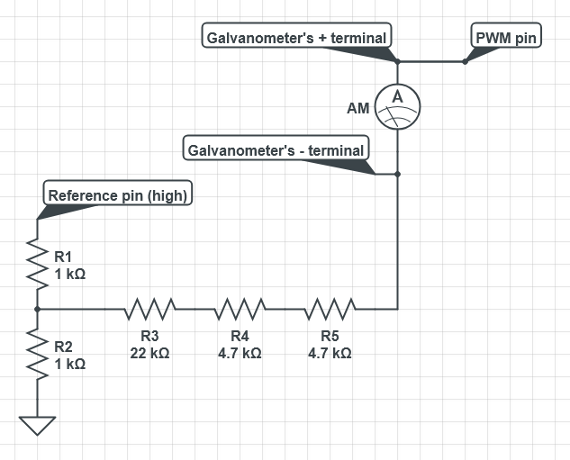

# Chat Galvanometer

A Windows desktop app that reads Twitch chat in real-time, scores message sentiment against configurable keywords, and drives a physical analog gauge via a serial port.

## What it does

Chat Galvanometer connects to a Twitch channel via the EventSub WebSocket API and watches for chat messages containing your chosen "good" or "bad" keywords. It maintains a rolling sentiment score over a configurable time window and continuously sends that score to a serial device for physical display.

## Features

- OAuth2 authentication with Twitch (browser-based, no manual token copying)
- Configurable good/bad keyword lists — any word or emote counts
- Rolling sentiment window with tunable duration and sensitivity
- Serial output at 115200 baud for hardware integration
- Username-to-ID lookup built in for quick setup
- All settings persisted to `settings.json` automatically
- Chat message logging to `chatLog.csv`

## Requirements

- Windows 10/11
- [.NET 8.0 Runtime](https://dotnet.microsoft.com/en-us/download/dotnet/8.0)
- A [Twitch Developer application](https://dev.twitch.tv/console) (for Client ID + OAuth)
- A serial device connected (for the needle output)

## Setup

1. **Register a Twitch application** at [dev.twitch.tv/console](https://dev.twitch.tv/console). Set the OAuth redirect URI to `http://localhost:3000`. Note your **Client ID**.

2. **Launch Chat Galvanometer** and paste your Client ID into the Authentication section.

3. **Click "Get Token"** — your browser will open to Twitch's login page. After authorizing, the token is captured automatically.

4. **Enter your Twitch username** and click **Lookup** to fill in your User ID.

5. **Enter the broadcaster's username** and click **Lookup** to fill in their ID.

6. **Select your COM port** from the dropdown and click **Test** to verify the connection (the needle should sweep all the way from left to right and then back to center).

7. **Click Connect** to start listening to chat.

## Configuration

Settings are saved to `settings.json` in the application directory. These are all maintainable within the application and should not require manual editing. Key fields:

| Field | Description |
|---|---|
| `ClientId` | Your Twitch application's Client ID |
| `BearerToken` | OAuth token (populated automatically) |
| `UserName` | Your twitch username |
| `UserId` | Your twitch account's id (found using lookup button) |
| `BroadcasterName` | The broadcaster's twitch channel to monitor |
| `BroadcasterId` | The broadcaster's twitch id (found using lookup button) |
| `ComPort` | Serial port the gauge is connected to (e.g. `COM3`) |
| `ComPorts` | Array of com port values found on the local computer (autodetected, not user configurable)|
| `WindowWidth`/`WindowHeight` | The user's last window dimensions |
| `EvaluationWindowLength` | Rolling window duration in seconds (default: 10) |
| `MaxSentiment` | Number of keyword hits that equals full deflection |
| `GoodItems` | List of positive keywords/emotes |
| `BadItems` | List of negative keywords/emotes |

## Sentiment tuning

Each chat message is scanned for entries in your Good and Bad lists. Matches increment or decrement a running counter. The app looks at all messages within the last `EvaluationWindowLength` seconds, sums the score, and maps it onto a -1.0 to +1.0 range capped at ±`MaxSentiment`. That value is sent to the hardware every 500 ms.

Start with a small `MaxSentiment` (e.g. 5–10) for a reactive needle, or raise it for a more stable reading in busy chats.

## Replaying old sessions

All incoming chat during a session is recorded into a `chatLog.csv` file, with the message and timestamp. **No usernames!**

If you want to replay such a file, you can select it using the "Choose file" button in the replay section at the bottom of the application. You can specify a starting time (in UTC like the file holds) or leave empty to begin at the start of the file.

Pressing "Start replay" will let the application start parsing messages from the file at the same rate they were recorded, just as if you were connected to a live stream.

## Hardware

The app sends sentiment values over serial as `{value}d` (e.g. `0.75d`), at 115200 baud, every 500 ms.

An Arduino sketch for a compatible galvanometer driver is included in `ChatGalvanometer_Hardware/ChatGalvanometer_Hardware.ino`. It reads the float value over serial and drives a galvanometer via PWM. Subtle wiggle occurs when the needle is holding on a value to add some life.

Example schematic (exact resistance will vary based on the characteristics of your galvanometer)
In the provided sketch, the reference pin `GALVO_ENABLE` is 24 and the PWM pin `GALVO_OUTPUT` is 25.
`GALVO_MIN`, `GALVO_NEUTRAL`, and `GALVO_MAX` must all be between 0 and 256 and should be tuned to your specific galvanometer to get the needle to visually line up with the middle of the scale and the two extremes.
